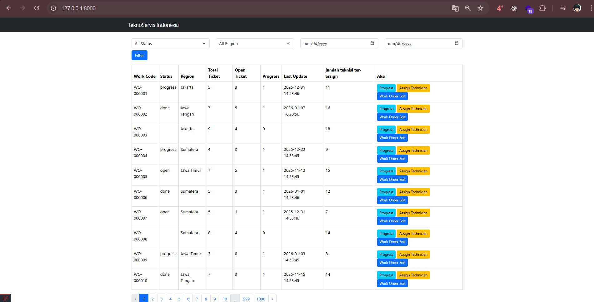
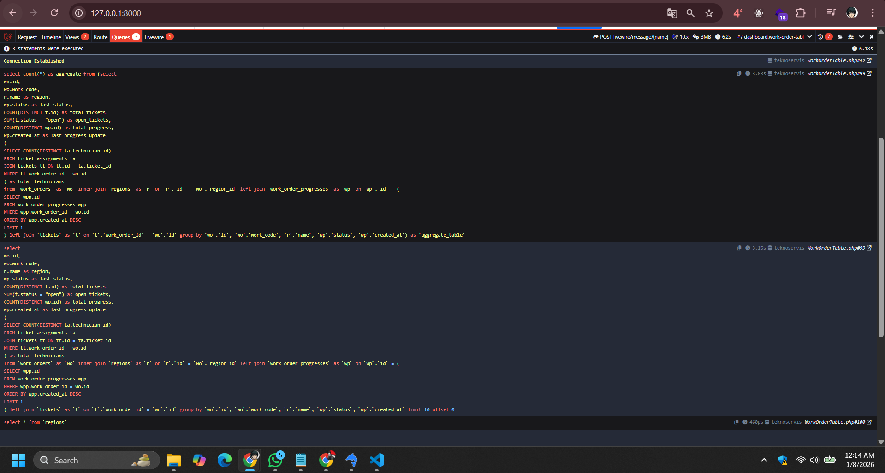
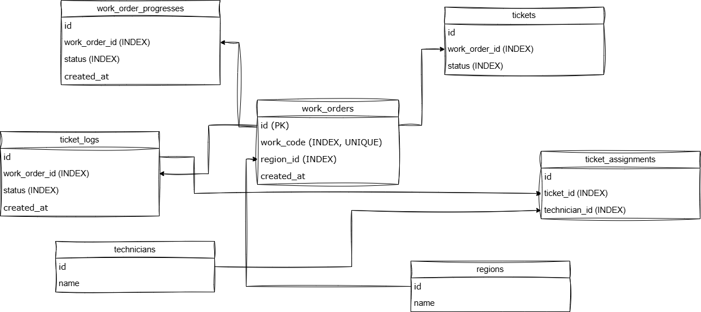

🛠️ TechnoServis Indonesia – Technical Test

Dashboard operasional untuk menangani Work Order, Ticket, Progress, dan Assignment Teknisi menggunakan Laravel + Livewire.

📦 Tech Stack

-   PHP 8.3
-   Laravel 10
-   Livewire 2
-   MySQL
-   Bootstrap 5.2.3
-   Laravel Debugbar

📁 Struktur Fitur Utama

-   Dashboard operasional (multi Livewire component)
-   Datatable Work Order (JOIN-based query)
-   Modal terpisah:
    -   WorkOrderEditModal
    -   TicketAssignModal
    -   WorkOrderProgressModal
-   Server-side pagination
-   Filter:
    -   Status terakhir
    -   Region
    -   Date range
-   Seeder data besar (10k+ record)

⚙️ Langkah Setup Proyek
1️⃣ Clone Repository

```bash
git clone https://github.com/username/sirs.git
cd teknoservis`
```

2️⃣ Install Dependency

```bash
composer install
```

3️⃣ Copy File Environment

```bash
cp .env.example .env
```

4️⃣ Konfigurasi Database
Edit file .env:

```bash
DB_CONNECTION=mysql
DB_HOST=127.0.0.1
DB_PORT=3306
DB_DATABASE=teknoservis
DB_USERNAME=root
DB_PASSWORD=
```

Pastikan database sudah dibuat di MySQL.

5️⃣ Generate App Key

```bash
php artisan key:generate
```

🗄️ Migration Database

Jalankan migration untuk membuat seluruh tabel:

```bash
php artisan migrate
```

🌱 Menjalankan Seeder (Data Besar)
Seeder akan membuat data dengan skala besar menggunakan batch insert:

-   5 regions
-   2.000 technicians
-   10.000 work orders
-   30.00 progress history
-   60.000 tickets
-   180.000 ticket logs
-   ticket assignments

Jalankan Seeder:

```bash
php artisan db:seed
```

⏱️ Estimasi waktu:

-   < 3 menit
-   Tergantung spesifikasi mesin

🚀 Menjalankan Aplikasi

```bash
php artisan serve
```

Buka di browser:

```bash
Buka di browser:
```

🧩 Routing
Dashboard utama menggunakan Controller + View untuk menampung multiple Livewire component
Beberapa halaman menggunakan route langsung ke Livewire component

🔄 Komunikasi Antar Komponen (Livewire)
Digunakan:

-   emit
-   emitTo
-   listeners

Contoh alur:

-   Klik tombol di tabel → buka modal
-   Submit modal → emit event → refresh tabel

🐞 Debug & Performance
Laravel Debugbar digunakan untuk:

-   Melihat total query
-   Execution time
-   Memory usage
-   Query paling berat

Debugbar otomatis aktif saat:

```bash
APP_DEBUG=true
```

📊 Catatan Performa

-   Query berbasis JOIN, tanpa eager loading
-   Tidak ada N+1 query
-   Pagination server-side
-   Index diterapkan pada kolom JOIN & filter

# ScreenshotTampilan hasil Program APlikasi



# Screenshot Laravel Debugbar yang menampilkan performa dan query



# Structure Database



# Struktur Laravel Project

app
├── Http
│ └── Controllers
│ └── DashboardController.php
│
├── Livewire
│ └── Dashboard
│ ├── WorkOrderTable.php
│ ├── WorkOrderEditModal.php
│ ├── TicketAssignModal.php
│ └── WorkOrderProgressModal.php
│
└── Models
├── WorkOrder.php
├── WorkOrderProgress.php
├── Ticket.php
├── TicketLog.php
├── Technician.php
├── TicketAssignment.php
└── Region.php

## 📂 resources/views

resources/views
├── layouts
│ └── app.blade.php
│
├── dashboard
│ └── index.blade.php
│
└── livewire
└── dashboard
├── work-order-table.blade.php
├── work-order-edit-modal.blade.php
├── ticket-assign-modal.blade.php
└── work-order-progress-modal.blade.php

## 📂 database/

database
├── migrations
│ ├── create_regions_table.php
│ ├── create_work_orders_table.php
│ ├── create_work_order_progresses_table.php
│ ├── create_tickets_table.php
│ ├── create_ticket_logs_table.php
│ ├── create_technicians_table.php
│ └── create_ticket_assignments_table.php
│
└── seeders
├── DatabaseSeeder.php
├── RegionSeeder.php
├── TechnicianSeeder.php
├── WorkOrderSeeder.php
├── WorkOrderProgressSeeder.php
├── TicketSeeder.php
├── TicketLogSeeder.php
└── TicketAssignmentSeeder.php

## 📂 routes

Contoh isi:

```bash
# single route
Route::get('/work-orders', WorkOrderTable::class);

# multi route

Route::get('/', [DashboardController::class, 'index']);
```
